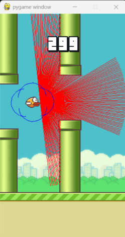

# 基於 PPO 演算法之 Flappy Bird 訓練優化研究：以 TensorBoard 分析雷達感測與低維狀態特徵

## 摘要

近年來，強化學習（Reinforcement Learning, RL）廣泛應用於遊戲控制、自主決策與人工智慧領域。其中，近端策略優化（Proximal Policy Optimization, PPO）因具備訓練穩定、實作容易與收斂能力佳等特性，成為常見的強化學習演算法之一。本研究以 Flappy Bird 作為測試環境，建立 PPO 訓練模型，並透過 TensorBoard 觀察訓練過程中的獎勵、存活長度、損失函數、探索程度與策略更新幅度。

本研究比較兩種不同觀測方式：高維雷達感測（Lidar-like Observation）與低維狀態空間（Low-dimensional State Space）。高維模型使用多方向射線取得環境資訊，低維模型則保留小鳥位置、速度與管道距離等核心狀態。透過 TensorBoard 曲線可觀察模型在訓練過程中的收斂趨勢與穩定性差異。整體而言，高維模型可能在早期快速提升獎勵，但曲線震盪較明顯；低維模型雖然提升速度較慢，但訓練變化較平穩，較有利於泛化與策略解釋。

本研究顯示，強化學習模型的表現不應只以最高分數判斷，而應結合 TensorBoard 訓練曲線，從獎勵、長度、損失與探索程度等指標分析模型是否真正穩定學習。

---

## 一、前言

### 1.1 研究背景

FlappyBird 是一款 2D 遊戲，玩家需控制小鳥穿越連續管道。

PPO 屬於策略梯度方法，特色是透過限制策略更新幅度降低訓練崩潰風險。然而，在實際訓練中，模型表現不只受到演算法影響，也受到 Observation 設計、Reward 設計與訓練穩定性的影響。若只觀察最終最高的分數，容易忽略模型是否出現震盪、過早收斂或過度依賴特定環境特徵等問題。

因此，本研究將 TensorBoard 作為主要分析工具，透過訓練過程中的多項曲線，觀察 PPO 模型在 Flappy Bird 環境中的學習狀態。

### 1.2 研究目的

1. 建立基於 PPO 的 Flappy Bird 訓練模型。
2. 使用 TensorBoard 監控訓練過程與模型收斂狀況。
3. 比較高維雷達感測與低維狀態特徵對訓練穩定性與呈現結果的影響。
4. 分析 reward、loss、entropy 與 KL divergence 等指標代表的訓練意義。
5. 分析 learning_rate、 clip_range、 n_steps、 batch_size 、ent_coef 等數值大小對穩定性和分數的影響。
6. 探討 Observation 設計對泛化能力與策略穩定性的影響。

---

## 二、PPO 演算法與 Flappy Bird 環境

### 2.1 系統架構

本研究的訓練流程如下：

```text
Flappy Bird 環境
→ Observation 設計（高維雷達／低維狀態）
→ PPO 神經網路
→ 動作輸出
→ 獎勵回饋
→ 策略更新
→ TensorBoard 紀錄與分析
```

模型在每一步會根據目前觀測值選擇動作，環境再回傳下一個狀態與獎勵。PPO 依據收集到的 rollout 資料更新策略，TensorBoard 則用來記錄訓練指標，方便後續分析。

### 2.2 PPO 演算法

PPO（Proximal Policy Optimization，近端策略優化）是一種常用的強化學習演算法，屬於策略梯度方法。模型會根據目前觀測值輸出動作機率，並在與環境互動後，利用獎勵結果調整策略，使未來更可能選到高回報的動作。

在本研究中，PPO 採用 actor-critic 架構。actor 負責決定小鳥是否跳躍，critic 則估計目前狀態的價值。訓練時，模型會先收集一段 rollout 資料，包括 observation、action、reward 與 episode 結果，再根據這些資料更新神經網路參數。

PPO 的核心概念是限制策略更新幅度，避免模型因參數變動過大而導致訓練不穩定。如果新策略和舊策略差異太大，模型可能會突然忘記原本有效的行為，造成 reward 曲線大幅震盪。因此，PPO 使用 clip 機制，將每次策略更新控制在合理範圍內。其剪裁目標函數如下：

```text
L_CLIP(θ) = E_t [ min( r_t(θ) * A_t, clip(r_t(θ), 1 - ε, 1 + ε) * A_t ) ]
```

其中：

- `r_t(θ)`：新策略與舊策略的機率比值。
- `A_t`：優勢函數，用來衡量某動作相對於平均表現的好壞。
- `ε`：剪裁範圍，用來限制策略更新幅度。

簡單來說，當某個動作帶來較好的結果時，PPO 會提高未來選擇該動作的機率；但如果更新幅度過大，clip 機制會限制它，避免策略突然改變太多。這也是後續觀察 `train/approx_kl` 與 `train/clip_fraction` 的原因：前者可用來判斷新舊策略差異，後者可用來觀察有多少比例的更新被 PPO 剪裁。

### 2.3 訓練環境與參數

本研究使用的軟體環境包含：

- Python
- Stable-Baselines3
- Gymnasium
- PyTorch
- TensorBoard

### 2.4 獎勵函數設計

本研究採用 reward shaping（獎勵整形）設計，將環境回饋拆成多個較小的引導訊號。這些訊號的目的不是只追求單次高分，而是讓模型在訓練初期能更快理解「存活、接近管道中心、避免危險速度」等行為的重要性。

| 事件 | Reward | 設計目的 |
| --- | --- | --- |
| 每一步存活 | `+0.05` | 提供穩定的小額回饋，鼓勵模型延長存活時間 |
| 分數增加 | `+0.2` | 鼓勵模型成功通過管道 |
| 撞擊或回合結束 | `-0.15` | 標示失敗狀態，降低危險策略的價值 |
| 接近管道中心 | 最高約 `+0.2`，距離越遠獎勵越小 | 引導小鳥靠近管道間隙中心，提高通過機率 |
| 位置與速度風險 | `-0.1` | 當小鳥在不利位置且速度過快下降時給予懲罰 |
| 穩定動作獎勵 | `+0.05` | 在接近中心時鼓勵較穩定的動作選擇 |

此設計方式採用 **稀疏目標 + 密集引導**：通過管道屬於較明確的目標訊號，存活與中心對齊則提供連續回饋，幫助模型在尚未穩定得分前也能得到學習方向。死亡懲罰用來標示遊戲結束，速度與位置相關的懲罰則協助模型避免過度危險的飛行狀態。

此外，訓練中加入熵獎勵（entropy bonus），鼓勵模型保留一定的隨機探索，不要太早固定成單一動作模式；reward shaping 則透過存活獎勵、通過管道獎勵與靠近管道中心的引導獎勵，幫助模型避免只依賴固定循環動作。這些設計可使策略較容易朝穩定飛行的方向學習，但是否具有泛化能力仍需透過額外測試驗證。

為了讓不同訓練設定更容易比較，本研究固定隨機種子，降低初始權重、環境隨機性與 PPO 採樣差異造成的影響。

**Reward Shaping 的應用：**

Reward shaping 是一種強化學習技術，透過添加額外的獎勵訊號來引導模型學習較合適的策略。本研究的 reward shaping 不只看是否通過管道，也加入存活、位置對齊、速度風險與動作穩定性等訊號，使模型能在每一步取得更細緻的回饋。

在 Flappy Bird 中，原始獎勵設計存在一個問題：模型可能學會「固定循環操作」——例如，在訓練過程中發現某個特定的上下振盪模式能夠偶爾通過管道，因此陷入這種局部最優解。此時，模型的獎勵可能短期內有所提升，但策略並未真正學會靈活應對不同的管道配置。

Reward shaping 透過以下方式解決此問題：

1. **存活與得分獎勵**：每一步存活給予小額獎勵，分數增加時再給予額外獎勵。這使模型同時重視延長存活時間與通過管道。

2. **中心對齊獎勵**：根據小鳥與管道間隙中心的距離給予獎勵，距離越近獎勵越高。這引導模型學習較安全的通過路徑，而不是只靠隨機上下振盪。

3. **速度與動作調整**：當小鳥在不利位置且下降速度過快時給予懲罰；當小鳥接近管道中心且選擇較穩定的動作時給予小額獎勵。這有助於降低過度劇烈的控制行為。

這些額外獎勵訊號能讓模型在訓練初期獲得更明確的學習方向。從 TensorBoard 曲線來看，reward shaping 有助於優化配置模型避免只依賴固定循環操作，並讓訓練表現更穩定；不過，若要判斷模型是否能泛化到不同遊戲配置，仍需要額外的測試實驗。

### 2.5 隨機種子與訓練再現性

在強化學習訓練中，隨機種子（seed）控制著初始神經網路權重、環境隨機數生成以及 PPO 採樣等隨機過程。不同的 seed 值會導致相同超參數下的訓練結果差異明顯，這使得直接比較不同配置的優劣變得困難。

**為了方便觀察和比較**，本研究在所有訓練中設置固定的 seed 值。這樣做的好處包括：

1. **再現性（Reproducibility）**：使用相同 seed 可確保相同超參數配置的訓練結果一致，便於驗證結論。

2. **公平對比**：當比較高維模型、低維模型與優化配置模型時，固定 seed 消除了隨機性帶來的干擾，使得觀察到的性能差異更能反映設計差異而非隨機波動。

3. **TensorBoard 曲線穩定性**：固定 seed 使得 TensorBoard 曲線更加平穩且易於比較，減少了隨機噪聲，便於識別訓練趨勢。

**在本研究中的應用方式**：

- 設置 Python、NumPy、PyTorch 及環境的 seed 為固定值（例如 42）
- 確保 Gymnasium 環境也使用相同 seed 初始化
- 記錄所有訓練使用的 seed 值，便於後續復現

通過固定 seed，本研究提高了訓練結果的可比較性。在報告中展示的數據表格和 TensorBoard 指標均基於相同的 seed 設定，因此不同模型間的性能差異較能反映設計差異，而不是完全來自隨機波動。

---

## 三、TensorBoard 訓練監控方法

### 3.1 TensorBoard 的用途

TensorBoard 是訓練監控與視覺化工具，可用來觀察模型在訓練過程中的表現變化。相較於只看最終分數，TensorBoard 能呈現模型在不同時間點的學習狀態，協助判斷模型是否穩定收斂、是否仍有探索能力，以及策略更新是否過大。

在 Stable-Baselines3 中，可透過 `tensorboard_log` 參數指定紀錄資料夾。例如：

```python
model = PPO(
    "MlpPolicy",
    env,
    learning_rate=2e-4,
    n_steps=2048,
    batch_size=256,
    gamma=0.99,
    ent_coef=0.01,
    tensorboard_log="./tb_logs/",
)

model.learn(total_timesteps=100000, tb_log_name="PPO")
```

訓練完成或訓練進行中，可使用以下指令啟動 TensorBoard：

```bash
tensorboard --logdir ./tb_logs/
```

### 3.2 主要觀察指標

本研究重點觀察以下 TensorBoard 指標：

| 指標 | 意義 | 分析重點 |
| --- | --- | --- |
| `rollout/ep_rew_mean` | 平均回合獎勵 | 判斷模型分數是否提升 |
| `rollout/ep_len_mean` | 平均回合長度 | 觀察小鳥是否能穩定存活 |
| `train/value_loss` | 價值函數誤差 | 判斷 critic 是否穩定學習 |
| `train/policy_gradient_loss` | 策略梯度損失 | 觀察策略是否持續更新 |
| `train/entropy_loss` | 探索程度 | 分析模型是否過早收斂 |
| `train/approx_kl` | 新舊策略差異 | 判斷策略更新幅度是否過大 |
| `train/clip_fraction` | 被 PPO 剪裁的比例 | 觀察更新是否過於激烈 |

這些指標能互相補充。例如 reward 上升不一定代表模型穩定，若同時出現 value loss 劇烈震盪或 approx KL 過高，可能代表策略更新過大，後續仍有崩潰風險。

---

## 四、Observation 設計：高維雷達與低維狀態特徵

### 4.1 高維雷達感測模型

高維模型使用 Lidar 的方式進行環境掃描，透過多方向射線取得障礙物與邊界資訊。



主要特徵包含：

- 180 方向射線。
- 障礙物距離。
- 地圖邊界資訊。

此方法能提供較完整的環境輪廓，因此模型可能在訓練早期快速找到得分方式。但高維輸入也可能讓神經網路記住局部圖樣或特定環境特徵，導致 TensorBoard 曲線出現 reward 快速上升後震盪、loss 不穩定或泛化能力不足的現象。

### 4.2 低維狀態特徵模型

低維模型只保留與決策直接相關的核心資訊。

主要特徵包含：

- bird_y, bird_vel = obs[9], obs[10]
- p1_x, p1_top, p1_bot = obs[3], obs[4], obs[5]
- p2_x, p2_top, p2_bot = obs[6], obs[7], obs[8]
`obs[]` 是 `flappy_bird_gymnasium` 官方套件提供的觀測資料。
每一幀會提取 9 個核心特徵，訓練時再堆疊最近 4 幀，因此 PPO 實際接收的是 36 維輸入向量。雖然資訊量比高維雷達感測少，但這些特徵更接近控制 Flappy Bird 所需的關鍵狀態。

### 4.3 兩種 Observation 比較

| 比較項目 | 高維雷達感測 | 低維狀態特徵 |
| --- | --- | --- |
| 資訊量 | 高，包含大量環境掃描資訊 | 低，保留核心決策資訊 |
| 訓練初期表現 | 可能快速提升 | 提升較慢 |
| 曲線穩定性 | 較容易震盪 | 較容易平穩 |
| 過擬合風險 | 較高 | 較低 |
| 泛化能力 | 需透過測試驗證 | 通常較有利 |

---

## 五、TensorBoard 實驗結果與分析

本章不再以單一模型編號或單次最高分作為主要判斷依據，而是改用 TensorBoard 曲線趨勢分析訓練品質。原因是強化學習訓練具有隨機性，某一次訓練的最高分可能只是短暫尖峰，不能直接代表策略真的穩定。相較之下，平均獎勵、平均回合長度、策略更新幅度與探索程度的變化，更能說明模型是否逐步學會控制小鳥。

本研究將訓練結果整理為三類設定進行比較：

| 設定類型 | Observation 設計 | 主要特徵 | 分析重點 |
| --- | --- | --- | --- |
| 高維雷達模型 | 多方向射線掃描 | 資訊量多，包含大量環境輪廓 | 觀察是否因輸入過多造成曲線震盪 |
| 低維狀態模型 | 每幀 9 個核心特徵，堆疊後 36 維 | 小鳥高度、速度、管道距離與中心偏移 | 觀察核心狀態是否讓訓練更平穩 |
| 優化配置模型 | 低維狀態 + reward shaping + 調整後超參數 | 加入中心對齊獎勵與較完整的 PPO 設定 | 觀察穩定性與存活能力是否同步提升 |

### 5.1 平均獎勵曲線：`rollout/ep_rew_mean`

`rollout/ep_rew_mean` 表示多個 episode 的平均獎勵，是觀察模型整體表現最直觀的指標。若平均獎勵長期上升，通常代表模型逐漸學會取得較好的行為；若曲線大幅上下震盪，則可能表示策略尚未穩定。

從 TensorBoard 曲線觀察，高維雷達模型在訓練初期可能較快找到得分方式，因為它接收到的環境資訊較完整。然而，資訊量過多也可能讓模型過度依賴某些局部特徵，導致 reward 曲線出現明顯震盪。低維狀態模型的提升速度較慢，但曲線通常較平順，表示策略更新比較保守。

優化配置模型在 reward shaping 與超參數調整後，平均獎勵曲線較能維持上升趨勢。這表示模型不只是偶爾通過管道，而是逐漸學到較穩定的飛行方式。因此，本研究在解讀 reward 時，不只看最高點，而是更重視後期是否能維持表現。

### 5.2 平均回合長度：`rollout/ep_len_mean`

`rollout/ep_len_mean` 表示每回合平均持續步數，可用來觀察小鳥是否能穩定存活。在 Flappy Bird 中，若模型真的學會控制，回合長度通常會隨著訓練逐漸增加。

平均獎勵與平均回合長度需要一起觀察。若 reward 短時間升高，但 ep_len_mean 沒有同步提升，可能代表模型只是偶然得分，或只在少數情況下成功通過管道。相反地，若 reward 與 ep_len_mean 同時改善，就比較能支持模型真的學到穩定飛行策略。

在本研究中，高維雷達模型容易出現「短期表現提高，但後續不穩定」的情況；低維狀態模型雖然提升較慢，但存活曲線較容易保持平穩。優化配置模型則透過存活獎勵、中心對齊獎勵與較穩定的 PPO 更新，使平均回合長度更能反映實際控制能力。

### 5.3 損失函數：`train/value_loss`、`train/policy_gradient_loss`

`train/value_loss` 反映 critic 對狀態價值估計的誤差，`train/policy_gradient_loss` 則反映 actor 策略更新的變化。這兩個指標不能單獨用來判斷模型好壞，但可以用來輔助觀察訓練是否穩定。

在 Flappy Bird 訓練中，如果 value loss 長期劇烈震盪，代表模型對「目前狀態值多少分」的估計不穩定。若 policy gradient loss 變化過大，可能表示策略更新不平順，模型每次更新後行為差異太大。

需要注意的是，不同 reward 設計會改變 value loss 的數值尺度。因此，優化配置模型加入 reward shaping 後，value loss 可能和原始設定不在同一個尺度上，不能直接用數字大小比較優劣。較合理的做法是把 loss 曲線與 reward、ep_len_mean、approx_kl 一起看，確認模型是否一邊提高表現、一邊維持穩定更新。

### 5.4 探索程度與策略更新：`train/entropy_loss`、`train/approx_kl`、`train/clip_fraction`

`train/entropy_loss` 可用來觀察模型是否保留探索能力。若 entropy 太快下降，模型可能過早固定成單一動作模式，後續遇到不同管道位置時較難調整。

`train/approx_kl` 代表新舊策略之間的差異，數值過高時，表示模型一次更新後改變太大，訓練可能變得不穩定。`train/clip_fraction` 則表示有多少比例的策略更新被 PPO 的 clip 機制限制；若比例過高，代表模型更新太激烈，需要降低 learning rate 或調整 clip range。

本研究的觀察重點如下：

| 指標 | 曲線正常時的意義 | 風險訊號 |
| --- | --- | --- |
| `entropy_loss` | 保留一定探索能力 | 太快接近 0，可能過早固定策略 |
| `approx_kl` | 新舊策略差異適中 | 突然飆高，代表策略更新過大 |
| `clip_fraction` | 只有部分更新被剪裁 | 長期偏高，代表更新過於激烈 |

整體而言，高維雷達模型因輸入資訊較多，較容易出現策略更新幅度過大的問題；低維狀態模型則因輸入較集中，策略更新相對平穩。優化配置模型透過 reward shaping、entropy 係數與 PPO 參數調整，使探索能力與更新幅度取得較好的平衡。

### 5.5 綜合比較

將上述指標合併觀察後，可以得到以下整理：

| 比較項目 | 高維雷達模型 | 低維狀態模型 | 優化配置模型 |
| --- | --- | --- | --- |
| 平均獎勵 | 初期可能提升較快，但較容易震盪 | 提升較慢，變化較平穩 | 較能維持穩定上升 |
| 回合長度 | 可能受策略震盪影響 | 較能反映穩定飛行能力 | 存活能力較明顯改善 |
| 策略更新 | 容易出現更新過大的風險 | 更新幅度較保守 | 更新較平衡 |
| 探索能力 | 可能較快衰減 | 衰減較慢 | 透過 entropy 係數維持探索 |
| 解釋性 | 較低，難判斷模型依賴哪些資訊 | 較高，特徵與控制行為直接相關 | 較高，能對應到 reward shaping 設計 |

因此，本研究認為，Flappy Bird 的控制任務不一定需要越高維的 observation。更重要的是 observation 是否包含決策所需的關鍵資訊，以及 reward 和 PPO 超參數是否能讓模型穩定學習。

---

## 六、討論：訓練穩定性、泛化能力與過擬合

### 6.1 為何不能只看最高分

在強化學習訓練中，最高分只能代表模型曾經達到某個表現，不代表策略穩定，也不代表模型能應對不同管道位置。若只看最高分，容易把短期運氣誤判成真正學習。

TensorBoard 的優點是能顯示整個訓練過程。例如 reward 曲線是否逐漸上升、ep_len_mean 是否同步增加、approx_kl 是否突然變大、entropy 是否太快下降。這些曲線能幫助判斷模型是否穩定進步，而不是只靠單次高分判斷。

### 6.2 高維 Observation 的風險

高維 Observation 能提供更多環境資訊，但資訊多不一定代表訓練效果更好。對神經網路而言，過多輸入可能增加學習難度，也可能讓模型記住訓練環境中的局部特徵，而不是學到真正通用的控制策略。

在本研究中，高維雷達模型的優點是能取得較完整的環境輪廓；缺點是曲線較容易震盪，策略更新也可能較激烈。因此，高維輸入需要搭配更謹慎的 learning rate、clip range 與探索設定，否則容易出現訓練不穩定。

### 6.3 低維 State 的重要性

好的 State 並非資訊越多越好，而是要包含決策所需的關鍵資訊。對 Flappy Bird 來說，小鳥高度、垂直速度、目標管道距離、管道間隙中心位置，已經能描述大部分控制需求。

低維狀態特徵的優點是較容易解釋，也能降低神經網路學習負擔。當模型輸入更接近實際決策需要時，TensorBoard 曲線通常更容易呈現平穩變化。這也是本研究採用每幀 9 個特徵並堆疊 4 幀的原因：既保留關鍵狀態，又加入短期動態資訊。

### 6.4 Reward Shaping 與超參數調整

Reward shaping 的目的，是在模型尚未能穩定通過管道前，提供更細緻的學習方向。本研究加入存活獎勵、通過管道獎勵、中心對齊獎勵與速度相關懲罰，使模型不只追求瞬間得分，也學習保持安全位置。

超參數調整則用來控制學習速度與策略更新幅度。例如 learning rate 過高時，reward 可能快速上升後震盪；clip range 或 clip_fraction 異常時，代表策略更新可能太激烈；entropy 係數太低時，模型可能太早停止探索。因此，本研究使用 TensorBoard 指標作為調整依據，而不是只反覆嘗試不同模型。

---

## 七、結論與實驗驗證

本研究以 PPO 演算法訓練 Flappy Bird 代理，並使用 TensorBoard 分析訓練過程。結果分析不依賴單次模型編號，而是改用曲線趨勢比較高維雷達模型、低維狀態模型與優化配置模型。

### 7.1 主要發現

1. **TensorBoard 比單次最高分更適合評估訓練品質**  
   最高分可能只是短暫尖峰，必須搭配平均獎勵、平均回合長度與策略更新指標一起判斷。

2. **平均獎勵與平均回合長度需要同步觀察**  
   若 reward 上升但 ep_len_mean 沒有提升，代表模型可能只是偶然得分；若兩者同步改善，較能支持模型真的學到穩定飛行。

3. **高維 observation 不一定帶來更穩定的訓練**  
   高維雷達能提供更多資訊，但也可能增加訓練難度，使策略更新更容易震盪。

4. **低維狀態特徵較容易解釋，也較符合 Flappy Bird 的控制需求**  
   每幀 9 個核心特徵加上 4 幀堆疊，能保留高度、速度、管道距離與短期動態資訊。

5. **Reward shaping 與 PPO 超參數會明顯影響訓練穩定性**  
   存活獎勵、中心對齊獎勵、entropy 係數、learning rate 與 clip range 共同影響模型是否能穩定學習。

### 7.2 未來改進方向

後續研究可加入更多測試條件，例如改變管道間距、遊戲速度或隨機種子，檢查模型是否真的具有泛化能力。也可以將高維雷達模型與低維狀態模型在相同訓練步數、相同 seed 下重新比較，讓實驗結果更公平。

此外，未來可把 TensorBoard 曲線截圖加入報告，使 reward、ep_len_mean、approx_kl、clip_fraction 的變化更直觀。這樣讀者不只看到文字分析，也能直接觀察模型訓練過程。

### 7.3 結語

本研究的核心結論是：**強化學習模型的表現不應只看最高分，而應結合 TensorBoard 曲線，從訓練穩定性、存活能力、探索程度與策略更新幅度進行完整評估。**

對 Flappy Bird 任務而言，低維但有意義的狀態特徵，加上合適的 reward shaping 與 PPO 超參數，通常比單純增加 observation 維度更有助於穩定訓練。

---

## 附錄 A：低維觀測設計實現

### A.1 低維特徵設計（每幀 9 維，堆疊後 36 維）

本研究實現的低維觀測設計每一幀包含以下 9 個特徵，旨在保留 Flappy Bird 控制所需的核心資訊。訓練時會堆疊最近 4 幀，因此 PPO 實際輸入為 36 維。

```python
FEATURE_NAMES = [
    "bird_y",                    # 小鳥垂直位置（歸一化到 [0, 1]）
    "bird_vel",                  # 小鳥垂直速度（估計方法：相鄰幀位置差）
    "target_x",                  # 目標管道水平距離（相對位置）
    "bird_minus_gap_center",     # 小鳥位置相對於管道間隙中心的偏移
    "target_top",                # 目標管道上邊界位置
    "target_bottom",             # 目標管道下邊界位置
    "bird_vel_mul_target_x",     # 交互特徵：速度 × 距離
    "falling_flag",              # 下降標誌（速度 < -0.5）
    "p2_x_if_p1_behind",        # 下一個管道距離（當前管道已過時）
]
```

### A.2 特徵提取流程

1. **取得環境觀測值**：由 `flappy_bird_gymnasium` 回傳原始 observation。
2. **選擇目標管道**：若第一組管道已經通過，改以第二組管道作為目標。
3. **計算管道中心**：由目標管道上下邊界計算 gap center。
4. **提取 9 個核心特徵**：包含小鳥高度、速度、目標管道距離、小鳥與中心的偏移量等。
5. **棧操作**：將 4 幀特徵堆疊，得到 36 維輸入向量。

### A.3 訓練配置（優化版）

```python
model = PPO(
    "MlpPolicy",
    env,
    learning_rate=lr_schedule(1e-3, 3e-4),
    n_steps=2048,
    batch_size=1024,
    n_epochs=5,
    gamma=0.995,
    gae_lambda=0.95,             # GAE 參數
    clip_range=0.2,              # PPO 剪裁範圍（標準值）
    ent_coef=0.07,               # 熵係數（鼓勵探索）
    seed=42,
    tensorboard_log="./tb_logs/",
    policy_kwargs=dict(
        net_arch=[128, 128, 64],
        activation_fn=torch.nn.ReLU
    ),
)
```

本次主要訓練設定的總訓練步數為 `10,000,000`，並使用 8 個平行環境收集資料。

### A.4 獎勵函數設計

```python
REWARD_SCHEME = {
    "step_alive": +0.05,
    "score_increase": +0.2,
    "collision": -0.15,
    "center_alignment": "最高約 +0.2，距離中心越遠獎勵越小",
    "bad_falling_state": -0.1,
    "stable_action_near_center": +0.05,
}
```

此設計讓模型同時考慮三個方向：(1) 延長存活時間，(2) 通過管道取得分數，(3) 盡量靠近安全通過區域。

---

## 八、參考文獻

---

1. Schulman, J., Wolski, F., Dhariwal, P., Radford, A., & Klimov, O. (2017). *Proximal Policy Optimization Algorithms*.
2. Sutton, R. S., & Barto, A. G. (2018). *Reinforcement Learning: An Introduction* (2nd ed.). MIT Press.
3. Stable-Baselines3 Contributors. *Stable-Baselines3 Documentation*.
4. Farama Foundation. *Gymnasium Documentation*.
5. markub3327. *flappy-bird-gymnasium*.
6. PyTorch Contributors. *PyTorch Documentation*.
7. TensorFlow Team. *TensorBoard Documentation*.
